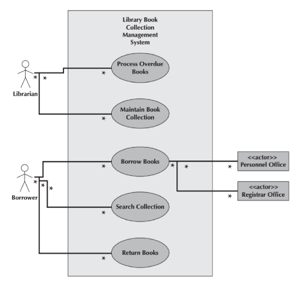
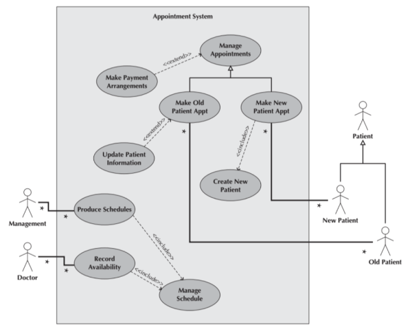
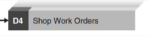
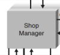
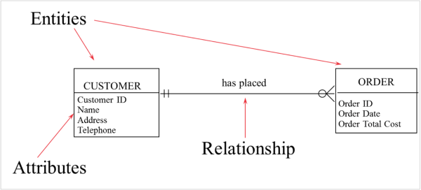

# WrittenTest

## How Do Systems Get Built?

 `Systems Development Life Cycle (S D L C)`

* `Planning`
* `Analysis`
* `Design`
* `Implementation`

---

## Planning Phase

Project Initiation
* `Prepare system request`
* `Perform preliminary feasibility analysis`

Set Up the Project
* `Project Plan, including work plan & staffing plan`

---

## Analysis Phase

Determine Analysis Strategy
* Study existing system and its problems

Collect and Analyze Requirements
* Develop new system concept
* Describe new system with analysis models

Prepare and Present System Proposal
* Summarize results of the Analysis Phase
* Go/No Go decision made by sponsor and steering committee

---

## Design Phase

Determine Design Strategy
* `Build / Buy / Outsource`

Design system components
* `Architecture, interface, database, programs`
* `Assemble design elements into System Specification`

Present to steering committee
* `Go /No Go decision before entering final phase`

---

## Implementation Phase

System Construction
* `Programming and testing`

System Installation
* `Training`
* `Conversion to new system`

On-going system support

---

## System Request

Describes business reasons for project 

Defines system’s expected value
* Force the sponsor to formalize his/her ideas
* Provide a framework for collecting initial project information
* Standardize information to be used by steering (approval) committee

Lists project’s key elements

---

## Feasibility Analysis

Detailed business case for the project
* `Technical feasibility`
* `Economic feasibility`
* `Organizational feasibility`

Compiled into a feasibility study

Critically important to reassess feasibility throughout the project

---

## Fact Finding Techniques 

  
| | Interviews | Joint Application Design | Questionnaires | Document Analysis | Observation |
| - | - | - | - | - | - |
| Type of information | As-is, improvements, to-be | As-is, improvements, to-be | As-is, improvements | As-is| As-is |
| Depth of information | High | High | Medium | Low | Low |
| Breadth of information | Low | Medium | High | High | Low |
| Integration of information | Low | High | Low | Low | Low |
| User involvement | Medium | High | Low | Low | Low |
| Cost | Medium | Low–Medium | Low | Low | Low–Medium |

---

## Object-Oriented Systems Analysis & Design

Characteristics of OOAD:
* Use-case Driven
* Architecture Centric
* Iterative and Incremental

---

## Characteristics of Object-Oriented Systems

Classes & Objects
* Object (instance): instantiation of a class
* Attributes: information that describes the class
* State: describes its values and relationships at a point in time

Methods & Messages
* Methods: the behavior of a class
* Messages: information sent to an object to trigger a method (procedure call)

Encapsulation & information hiding
* Encapsulation: combination of process & data
* Information hiding: functionality is hidden

Inheritance
* General classes are created (superclasses)
* Subclasses can inherit data and methods from a superclass

---

## Object-Oriented Systems Analysis & Design

Use-case driven
* Use-cases define the behavior of a system
* Each use-case focuses on one business process

Architecture centric
* Functional (external) view: focuses on the user’s perspective
* Static (structural) view: focuses on attributes, methods, classes & relationships
* Dynamic (behavioral) view: focuses on messages between classes and resulting behaviors

Iterative & incremental
* Undergoes continuous testing & refinement
* The analyst understands the system better over time

Benefits of OOSAD
* Break a complex system into smaller, more manageable modules
* Work on modules individually

---

## Business Process Identification With Use-Cases

---

## Identifying Major Use-Cases

Review the requirements definition

Identify the subject’s boundaries

Identify the primary actors and their goals

Identify the business processes and major use-cases

Carefully review the current set of use-cases
* Split or combine some to create the right size
* Identify additional use-cases

---

## Create a Use-Case Diagram

* Place & draw the use-cases
* Place & draw the actors
* Draw the subject boundary
* Add the associations

---

## Example Use-Case

---

## D F D Elements

* Process
  + An activity or function performed for a specific business reason
  + Can be manual or computerized
  + Includes the following:
    - A number
    - A name (verb phrase)
    - A description
    - At least one output data flow
    - At least one input data flow
  + Logical process models omit any processes that simply move or route data and leave the data unchanged.
  + You do include logical processes that:
    - Perform computations (e.g., calculate grade point average)
    - Make decisions (e.g., determine availability of ordered products)
    - Sort, filter or otherwise summarize data (e.g., identify overdue invoices)
    - Organize data into useful information (e.g., generate a report or answer a question)
    - Trigger other processes (e.g., turn on the furnace or instruct a robot)
    - Use stored data (create, read, update or delete a record)

* Data flow
  + A single piece of data or a logical collection of data
  + Data Flow names describe the content of the data flow but not how it is implemented
  + Always starts or ends at a process
  + Includes the following:
    - A name (noun)
    - Description
    - One or more connections to a process
  + A data flow is data in motion.
    - an input of data to a process, or the output of data (or information) from a process.
    - the creation, deletion, or update of data in a file or database (called a data store on the DFD).
    - A data flow is depicted as a solid-line with arrow.
    - Control flows (non-data flows) trigger processes, such as ‘time to run the weekly payroll’
    - The control flow is depicted as a dashed-line with arrow.

* Data Store
  + Most information systems capture data for later use.
  + A data store is a collection of data that is stored in some way
  + Include the following:
    - A number
    - A name (noun)
    - Description
    - One or more input data flows (somewhere in process model)
    - One or more output data flows (somewhere in process model)
  + If data flows are data in motion, think of data stores as data at rest.
  + Data stores should describe “things” about which the business wants to store data.
  + Data flows leaving the data store are data retrievals
  + Data flows entering the data store are updates or new data added

* External entity
  + A person, organization, or system that is external to the system
  + Has interactions with the system (adds data to system or receives data from system)
  + Include the following:
  + A name (noun)
  + Description

---

## Depicting Business Processes with D F Ds

* Business processes are too complex to be shown on a single DFD
* A deliberate hierarchy is created with multiple “levels” of DFDs
* To build the hierarchy, use `Decomposition`
  + Child diagrams show a portion of the parent diagram in greater detail

---

## D F D Hierarchy

* Context Diagram decomposes into Level 0 diagram

* Processes on Level 0 diagram each decompose into separate Level 1 diagrams
* Processes on Level 1 diagrams may or may not be decomposed into separate Level 2 diagrams.
* Processes are decomposed until each process is a single-purpose, primitive process.

---

## Reading an E R D

---

## Using the E R D to Show Business Rules

* Business rules are constraints that are followed when the system is in operation.
* ERD symbols can show when one instance of an entity must exist for an instance of another to exist
  + The customer instance must exist before custom drone order instances can be created for that customer
  + The drone component instance must exist before ordered drone components instances can be created for that drone component
* ERD symbols can show when one instance of an entity can be related to only one or to many instances of another entity
  + One customer instance can create many custom drone order instances; each custom drone order instance is created by only one customer instance
  + A drone can be included on many chemical requests; a chemical request is for only one chemical
* ERD symbols show when the existence of an entity instance is optional for a related entity instance
  + A customer instance may exist without being included on any custom drone order instances

---

## An E R D Example

---

## Acquisition Strategy Selection Factors

| | When to Use Custom Development | When to Use a Packaged System | When to Use Outsourcing |
| - | - | - | - |
| Business need | The business need is unique. | The business need is common. | The business need is not core to the business. |
| In-house experience | In-house functional and technical experience exists. | In-house functional experience exists. | In-house functional or technical experience does not exist. |
| Project skills | There is a desire to build in-house skills. | The skills are not strategic. | The decision to outsource is a strategic decision. | 
| Project management | The project has a highly skilled project manager and a proven methodology. | The project has a project manager who can coordinate vendor’s efforts. | The project has a highly skilled project manager at the level of the organization that matches the scope of the outsourcing deal. | 
| Time frame | The time frame is flexible. | The time frame is short. | The time frame is short or flexible. |

---

## Metaphor Details

